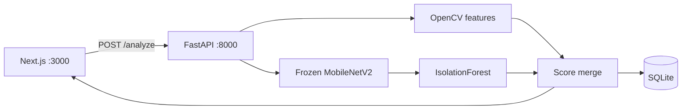

# ImageAudit

**AI-powered image quality & defect detection** — a full-stack MVP that accepts an image and reports whether it is acceptable, degraded, or defective, with explainable issues (blur, exposure, noise, corruption, visual anomaly).

No external AI/vision APIs. Everything runs **locally on CPU**.

| Layer | Stack |
|-------|--------|
| Frontend | Next.js / React / TypeScript / Tailwind (v0.dev) |
| Backend | Python, FastAPI, SQLAlchemy, SQLite |
| ML | OpenCV + NumPy, frozen **MobileNetV2** (ImageNet), **IsolationForest** |

Full documentation: **[docs/](docs/README.md)**

---

## What it detects

- Blur / insufficient sharpness  
- Underexposure / overexposure  
- Image noise  
- Corruption / severe degradation  
- Potential visual defect (embedding anomaly vs “normal” images)

---

## How it works (short)

Hybrid pipeline:

1. **Classical CV** extracts sharpness, brightness, contrast, noise → rule-based `issues[]`  
2. **Frozen MobileNetV2** produces an embedding (transfer learning / model acquisition — weights never trained here)  
3. **IsolationForest** scores how anomalous that embedding is vs fitted normals  
4. Scores merge into `quality_score` (0–100) and `ACCEPTABLE` | `DEGRADED` | `DEFECTIVE`



Deep dive: [docs/architecture.md](docs/architecture.md) · [docs/ml-pipeline.md](docs/ml-pipeline.md)

**Current score merge (simplified):**

```text
effective_anomaly = max(0, anomaly_conf - 0.18)
base              = 100 - effective_anomaly * 80
quality_score     = clamp(base - cv_penalty, 0, 100)
```

Blur penalties are weighted heavier than other CV issues so soft images don’t score like sharp ones. Buckets: ≥70 acceptable, ≥40 degraded, else defective.

---

## Quick start

### Backend (`:8000`)

Use the project **`.venv`** (system `uvicorn` → `No module named 'cv2'`).

**PowerShell:**

```powershell
cd C:\Users\ashwi\Documents\Repositories\ImageAudit
python -m venv .venv          # once
.\.venv\Scripts\Activate.ps1
pip install -r backend\requirements.txt   # once

cd backend
$env:PYTHONPATH = "."         # not: set PYTHONPATH=.
uvicorn app.main:app --host 0.0.0.0 --port 8000
# or: .\run.ps1
```

Health: [http://localhost:8000/health](http://localhost:8000/health)  
Swagger: [http://localhost:8000/docs](http://localhost:8000/docs)

### Frontend (`:3000`)

```bash
cd frontend
npm install --legacy-peer-deps
npm install workflow --legacy-peer-deps
npm run dev
```

Open [http://localhost:3000](http://localhost:3000). API base defaults to `http://localhost:8000`.

Step-by-step and troubleshooting: [docs/setup.md](docs/setup.md)

---

## API (overview)

| Method | Path | Purpose |
|--------|------|---------|
| `GET` | `/health` | Status + `model_loaded` |
| `POST` | `/analyze` | Multipart field **`file`** → analysis JSON + `id` |
| `GET` | `/results/{id}` | One stored result |
| `GET` | `/history` | Recent analyses + `thumbnail_url` |

```bash
curl -X POST -F "file=@sample_images/acceptable/acceptable_00.jpg" http://localhost:8000/analyze
```

Full reference (schemas, errors, examples): [docs/api.md](docs/api.md)

---

## Data, training & evaluation

Public images live under `sample_images/` (CERTH, SIDD, koniq, plus small demo folders). Build a **capped** label set, fit the anomaly detector, evaluate:

```powershell
cd backend
$env:PYTHONPATH = "."
python -m app.training.sample_from_public
python -m app.training.fit_anomaly_detector
python -m app.training.evaluate_model
```

Artifacts: `backend/data/labels.csv`, `backend/model/anomaly_detector.joblib`, `backend/model/eval_report.json`.

Details & limitations: [docs/data-and-evaluation.md](docs/data-and-evaluation.md)

---

## Project layout

```
ImageAudit/
  README.md                 # you are here
  docs/                     # architecture, API, ML, data, setup
  backend/
    app/                    # FastAPI + CV + embeddings + anomaly merge
    app/training/           # sample / fit / evaluate scripts
    model/                  # anomaly_detector.joblib, eval_report.json
    data/                   # labels.csv (and optional raw/)
    uploads/                # saved uploads
    run.ps1                 # start API with .venv
    requirements.txt
  frontend/                 # Next.js UI (v0) — match API on backend
  sample_images/            # public + demo images
```

---

## Documentation index

| Doc | Description |
|-----|-------------|
| [docs/README.md](docs/README.md) | Docs home |
| [docs/architecture.md](docs/architecture.md) | System & sequence diagrams, modules |
| [docs/api.md](docs/api.md) | REST API reference |
| [docs/ml-pipeline.md](docs/ml-pipeline.md) | Features, thresholds, scoring |
| [docs/data-and-evaluation.md](docs/data-and-evaluation.md) | Datasets, fit/eval, limits |
| [docs/setup.md](docs/setup.md) | Install, env vars, common errors |

---

## Continuous integration

GitHub Actions runs on every push and pull request to `main`.

| Workflow | What it checks |
|----------|----------------|
| [CI](.github/workflows/ci.yml) | Frontend `npm ci` + `next build`; backend `pip install` + FastAPI import smoke; Gitleaks secret scan; `npm audit` and `pip-audit` (high/critical only) |
| [CodeQL](.github/workflows/codeql.yml) | Static analysis for JavaScript/TypeScript and Python (PR, push, weekly) |
| [Dependabot](.github/dependabot.yml) | Weekly dependency update PRs for npm, pip, and GitHub Actions |

**Expected runtime:** ~8–12 minutes on a cold run (backend PyTorch install is the slowest step); faster with pip/npm caches.

**Phase 2 (not yet enforced):** ESLint, strict TypeScript (`tsc --noEmit`), and removing `ignoreBuildErrors` in `frontend/next.config.mjs`.

To require checks before merge, enable branch protection on `main` and select the `CI` workflow jobs.

---

## Deployment

Local Docker Compose / cloud is a **next step**. This pass targets a reproducible local MVP (backend + frontend).

---

## Licenses & attribution

When using third-party datasets, follow their terms and cite them (e.g. **CERTH** Image Blur Dataset, **SIDD**, **koniq-10k**, and **MVTec AD** non-commercial research/evaluation license if applicable).
