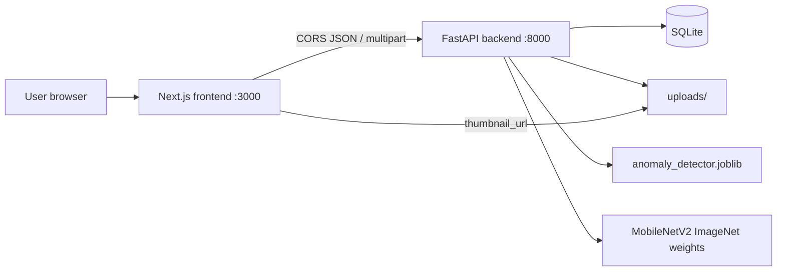
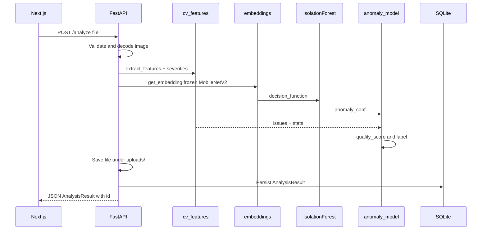
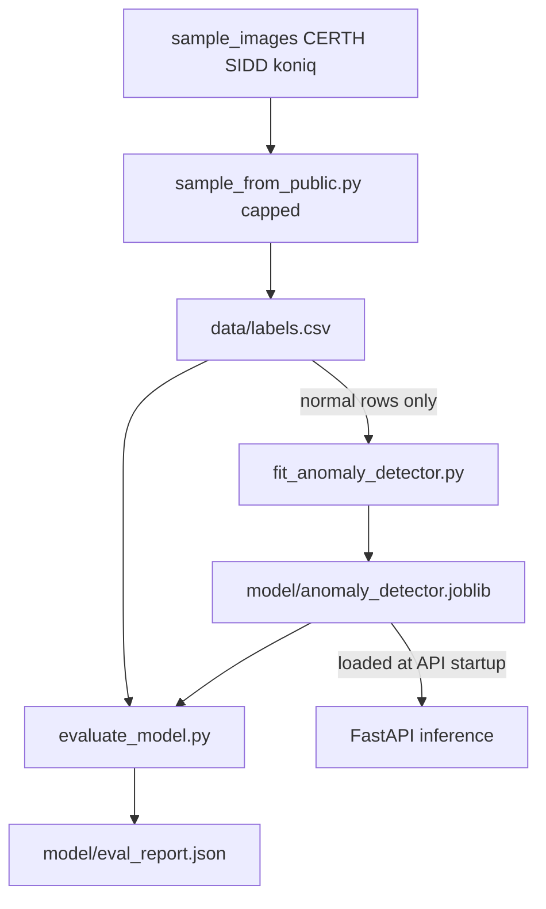

# Architecture

ImageAudit is a local full-stack app: a **Next.js** UI talks to a **FastAPI** backend that runs a **hybrid** quality pipeline (classical OpenCV + frozen deep embeddings + IsolationForest).

No external AI/vision APIs are used. Inference runs on **CPU**.

---

## 1. System context

| Piece | Role |
|-------|------|
| `frontend/` | Upload UI, results, history (v0.dev Next.js app) |
| `backend/app/` | REST API, CV, embeddings, score merge, persistence |
| SQLite | Stores past analyses (`DATABASE_URL`) |
| `backend/uploads/` | Saved originals; served at `/uploads/...` |
| `backend/model/` | Fitted IsolationForest + eval report |

---

## 2. Analyze request flow

When the user uploads an image, the frontend calls `POST /analyze` with multipart field `file`.

**In words:**

1. Reject non-images / unreadable bytes (`400`).
2. Extract classical features → rule-based `issues[]` (blur, exposure, noise, corruption).
3. Extract a 1280-d embedding from **frozen** MobileNetV2.
4. Score the embedding with IsolationForest → `anomaly_conf` (and optionally `visual_defect`).
5. Merge into `quality_score` / `quality_label` + human-readable `explanation`.
6. Persist row + file; return JSON matching the frontend contract.

Details: [ml-pipeline.md](ml-pipeline.md), [api.md](api.md).

---

## 3. Training / fit pipeline

The deep backbone is **never trained**. Only a lightweight anomaly detector is fitted on **normal** embeddings.

Optional alternate: copy labeled folders into `backend/data/raw/<label>/` and run `build_dataset.py` instead of `sample_from_public.py`.

Details: [data-and-evaluation.md](data-and-evaluation.md).

---

## 4. Module map

### Backend

| Module | Responsibility |
|--------|----------------|
| [`app/main.py`](../backend/app/main.py) | FastAPI routes, CORS, uploads, DB wiring |
| [`app/schemas.py`](../backend/app/schemas.py) | Pydantic request/response models |
| [`app/models.py`](../backend/app/models.py) | SQLAlchemy `AnalysisResult` |
| [`app/database.py`](../backend/app/database.py) | Engine / session (`DATABASE_URL`) |
| [`app/cv_features.py`](../backend/app/cv_features.py) | OpenCV features + severity thresholds + penalties |
| [`app/embeddings.py`](../backend/app/embeddings.py) | Frozen MobileNetV2 embedding extractor |
| [`app/anomaly_model.py`](../backend/app/anomaly_model.py) | Load IF, merge CV + anomaly → API payload |
| [`app/training/sample_from_public.py`](../backend/app/training/sample_from_public.py) | Cap-sample public datasets → `labels.csv` |
| [`app/training/fit_anomaly_detector.py`](../backend/app/training/fit_anomaly_detector.py) | Fit IsolationForest on normal embeddings |
| [`app/training/evaluate_model.py`](../backend/app/training/evaluate_model.py) | ROC-AUC / F1 / confusion → `eval_report.json` |
| [`backend/run.ps1`](../backend/run.ps1) | Windows helper: run uvicorn via project `.venv` |

### Frontend (do not change for API mismatches — fix the backend)

| Module | Responsibility |
|--------|----------------|
| [`frontend/lib/image-audit-api.ts`](../frontend/lib/image-audit-api.ts) | `analyzeImage`, `fetchHistory`, `fetchResultById` |
| [`frontend/components/image-audit/types.ts`](../frontend/components/image-audit/types.ts) | TypeScript contract for results / history |

---

## 5. Design choices (why this shape)

- **Hybrid (CV + DL anomaly)** matches the assessment’s allowed approaches (classical features, transfer learning / model acquisition, anomaly detection, hybrid).
- **Frozen ImageNet backbone** gives a real deep-learning component without training a CNN from scratch on a small set.
- **Rule-based CV issues** keep blur / exposure / noise **explainable**.
- **SQLite + disk uploads** keep the MVP simple and reproducible locally.
- **Docker / cloud** intentionally deferred; local two-process run is the supported path today.

Next: [API reference](api.md) · [ML pipeline](ml-pipeline.md)
