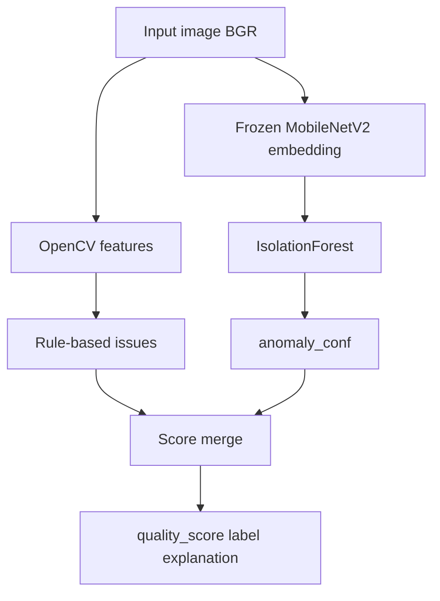

# ML / computer-vision pipeline

ImageAudit uses a **hybrid** approach:

1. **Classical CV** — measurable image stats + rule-based issue severities (explainable).
2. **Transfer learning / model acquisition** — frozen **MobileNetV2** ImageNet weights as an embedding extractor (never fine-tuned).
3. **Anomaly detection** — **IsolationForest** fitted only on embeddings of **normal** images.

Together they produce `issues[]`, `image_stats`, `quality_score`, `quality_label`, and an `explanation` string.



---

## 1. Classical features (`cv_features.py`)

| Feature | How it is computed | Role |
|---------|-------------------|------|
| `blur_score` | Variance of Laplacian on grayscale | Higher → sharper |
| `brightness_mean` | Mean grayscale intensity | Exposure |
| `brightness_std` / `contrast` | Std of grayscale | Contrast proxy |
| `noise_estimate` | Std of `(gray − medianBlur(gray))` | High-frequency residual |
| `saturation_mean` | Mean of HSV S channel | Colorfulness |
| `corruption_flag` | Tiny/huge dims or near-zero variance | Severe degradation / bad decode |

### Severity bands (current)

Severities are `low` | `medium` | `high` (never `none` — absent issues are simply omitted).

**Blur** (worse when Laplacian is **lower**):

| Severity | Condition |
|----------|-----------|
| high | `blur_score` &lt; 40 |
| medium | &lt; 120 |
| low | &lt; 200 |
| (none) | ≥ 200 |

**Underexposure** (worse when brightness is **lower**):

| Severity | Condition |
|----------|-----------|
| high | brightness &lt; 30 |
| medium | &lt; 50 |
| low | &lt; 65 |
| (none) | ≥ 65 |

**Overexposure** (worse when brightness is **higher**):

| Severity | Condition |
|----------|-----------|
| high | brightness &gt; 220 |
| medium | &gt; 200 |
| low | &gt; 180 |

**Noise** (worse when estimate is **higher**):

| Severity | Condition |
|----------|-----------|
| high | noise &gt; 45 |
| medium | &gt; 35 |
| low | &gt; 28 |

These thresholds were tuned so dim but intentional portraits (~70 brightness) are not over-flagged, and soft images (~Laplacian 96) register as **medium** blur rather than low.

### CV penalties

Penalties subtract from the quality base score. **Blur is weighted heavier** so a soft image cannot score nearly the same as a sharp one.

| Issue type | low | medium | high |
|------------|-----|--------|------|
| `blur` | 12 | 28 | 40 |
| other CV issues | 8 | 16 | 26 |

Total CV penalty is capped at 70.

---

## 2. Embeddings (`embeddings.py`)

- Model: **MobileNetV2**, weights `IMAGENET1K_V1` (torchvision).
- Classifier head replaced with `Identity` → **1280-d** feature vector.
- All parameters `requires_grad = False` — **never trained or fine-tuned**.
- Standard ImageNet preprocessing (resize / crop / normalize).
- Embedding is **L2-normalized**.
- Runs on **CPU** (no GPU required).

This satisfies “training **or model acquisition**”: the CNN knowledge comes from ImageNet pretraining.

---

## 3. Anomaly detector (`fit_anomaly_detector.py` + `anomaly_model.py`)

### Fit (offline)

1. Load rows labeled `normal` / `clean` from `data/labels.csv`.
2. Compute embeddings for each (large frames downscaled for speed).
3. Fit `sklearn.ensemble.IsolationForest` (`n_estimators=100`, `contamination=0.05`, `random_state=42`).
4. Save `backend/model/anomaly_detector.joblib` with metadata:
   - `train_decision_mean`
   - `decision_scale` (from train decision std)
   - backbone name, `n_train`, `embedding_dim`

### Inference score

IsolationForest `decision_function`: **higher → more normal**.

```text
delta = train_decision_mean - decision
anomaly_conf = sigmoid(delta / scale - 2)
```

`anomaly_conf` ∈ [0, 1], higher → more defective-looking in embedding space.

If `anomaly_conf ≥ 0.55`, a `visual_defect` issue is added (severity by confidence bands).

---

## 4. Score merge (final quality)

```text
effective_anomaly = max(0, anomaly_conf - 0.18)   # ignore mild in-distribution noise
base              = 100 - effective_anomaly * 80
quality_score     = clamp(base - cv_penalty(issues), 0, 100)
```

Then:

| Label | Score |
|-------|-------|
| `ACCEPTABLE` | ≥ 70 |
| `DEGRADED` | ≥ 40 |
| `DEFECTIVE` | &lt; 40 |

Extra clamps:

- `visual_defect` medium → score ≤ 55; high → ≤ 35  
- `corruption_flag` → score ≤ 25  

### Example (illustrative)

| Image | Laplacian | Brightness | Typical outcome |
|-------|-----------|------------|-----------------|
| Sharp portrait | ~345 | ~74 | No CV issues → **ACCEPTABLE** (~90+) |
| Soft portrait | ~96 | ~69 | Blur **medium** (−28) → **DEGRADED** (~65) |

---

## 5. Explainability

Reviewers (and the UI) can see:

1. **`image_stats`** — raw sharpness / brightness / contrast / noise.
2. **`issues[]`** — which rules fired, with severity + confidence.
3. **`explanation`** — one sentence with `anomaly_conf`, IF decision, CV issues, and final score → label.

No Grad-CAM / heatmaps in this MVP (optional bonus, not required).

---

## 6. Why hybrid (not CV-only or DL-only)

| Approach | Strength | Weakness alone |
|----------|----------|----------------|
| CV rules | Interpretable blur/exposure/noise | Misses “looks defective” without handcrafted defect features |
| Frozen embeddings + IF | Captures unusual appearance vs normals | Weak alone on photometric issues; needs clear formulation |
| **Hybrid** | Both: rules for measurable defects + anomaly for visual oddity | Must document merge (this page) |

Next: [Data & evaluation](data-and-evaluation.md) · [API](api.md)
